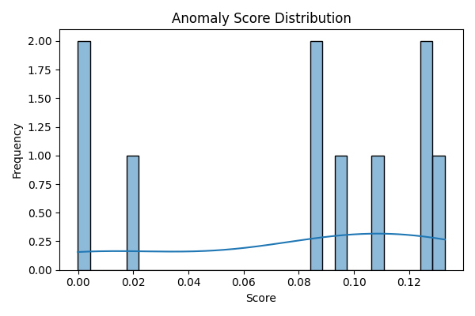

# 🔍 Interpretable Anomaly Detection for Security Telemetry

## 📌 Overview

This project presents a lightweight and interpretable machine learning
pipeline for detecting anomalous behaviour in heterogeneous security
telemetry. It is designed to reflect real-world analytical challenges
commonly encountered in crime and cybersecurity environments, where data
may be noisy, incomplete, and strategically manipulated.

The implementation focuses on **Isolation Forest--based anomaly
detection** combined with transparent preprocessing and visual analysis
to support human decision-making.

------------------------------------------------------------------------

## 🎯 Motivation

Security and crime-related datasets often exhibit:

-   High heterogeneity across sources\
-   Noise and missing or partial observations\
-   Severe class imbalance\
-   Potential adversarial manipulation

Traditional rule-based monitoring struggles in such environments. This
repository demonstrates how unsupervised anomaly detection can provide
**robust and interpretable decision support** for analysts working with
complex telemetry.

------------------------------------------------------------------------

## 🧠 Methodology

The pipeline follows a structured workflow:

1.  **Data ingestion and preprocessing**
2.  **Feature selection from numeric telemetry**
3.  **Isolation Forest model training**
4.  **Anomaly scoring and flagging**
5.  **Distribution visualisation for analyst interpretation**

The emphasis is on **practical robustness and interpretability**, rather
than purely optimising predictive performance.

------------------------------------------------------------------------

## 🗂️ Repository Structure

    ai-anomaly-security/
    ├── data/          # Sample security telemetry
    ├── notebooks/     # Reproducible experiment notebook
    ├── src/           # Modular pipeline code
    ├── results/       # Generated visual outputs
    ├── requirements.txt
    └── README.md

------------------------------------------------------------------------

## 🚀 Quick Start

``` bash
pip install -r requirements.txt
jupyter notebook notebooks/anomaly_detection.ipynb
```

Run **Kernel → Restart & Run All** to reproduce results.

------------------------------------------------------------------------

## 📊 Example Output



The model produces anomaly scores and flags that can support
analyst-driven investigation workflows in security operations
environments.

------------------------------------------------------------------------

## 🔬 Relevance to Crime & Security Analytics

This prototype reflects conditions common in operational environments:

-   Heterogeneous telemetry streams\
-   Uncertain or missing ground truth\
-   Adversarial behavioural patterns\
-   Need for interpretable decision support

Future work may explore richer feature engineering, hybrid human‑AI
workflows, and evaluation on larger real-world datasets.

------------------------------------------------------------------------

## 👤 Author

**Mary Amoah**\
Cybersecurity & AI Security Research Enthusiast\
GitHub: https://github.com/maryamoah

------------------------------------------------------------------------

## ⭐ License

This project is released under the MIT License.
